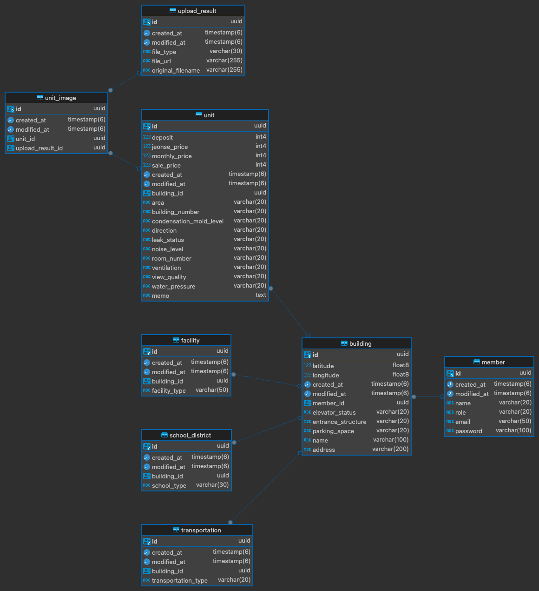

# 프로젝트 소개

- 부동산 임장 정보 관리 서비스 개발
# 진행 상황
- [x] 웹 프론트엔드, 백엔드 개발
- [ ] React Native Webview 앱 개발

# 사용 기술
- Backend
  - Java 17, Spring Boot 3.1.2, Spring Data JPA, Spring Security, Spring Validation, PostgreSQL, QueryDSL
- AWS
  - S3, EC2, ECR, RDS
- Container
  - Docker, Docker Compose
- Frontend
  - Spring Thymeleaf, Javascript, JQuery, HTML, CSS
- 외부 API
  - 네이버 지도, 카카오 주소 찾기

# 주요 기능
- 부동산 임장 정보 관리
  - 건물 정보 관리
  - 세대 정보 관리
- 회원가입 및 로그인
  - Spring Security 사용 세션 기반 인증
- 사진 첨부
  - AWS S3 사용
- 주소 검색 및 지도에 마커 표시
  - Daum 주소 API
  - 네이버 지도 API
    - 마커 기능
    - Geocoder를 사용하여 주소 => 좌표 변환

# 서비스 배포 방법

1. Gradle 빌드
2. Docker 이미지 빌드 및 ECR로 Push
3. EC2에서 ECR에 업로드한 Docker 이미지 Pull
4. docker-compose up -d 하여 서버 시작

# ERD

