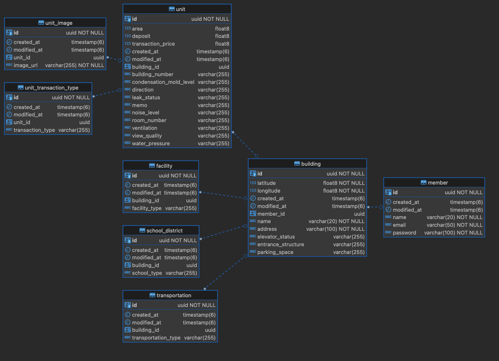

# 프로젝트 소개

- 부동산 임장 정보 기록 앱 개발 프로젝트 중 백엔드

# 사용 기술

- Java 17
- Spring Boot 3.1.2
- Postgresql
- Spring Data Jpa, Spring Security, Spring Validation 등
- AWS S3

# 주요 기능

- 부동산 임장 정보 저장, 조회, 삭제
- Spring Security를 사용한 JWT 인증 및 인가
- AWS S3 파일 업로드

# ERD

